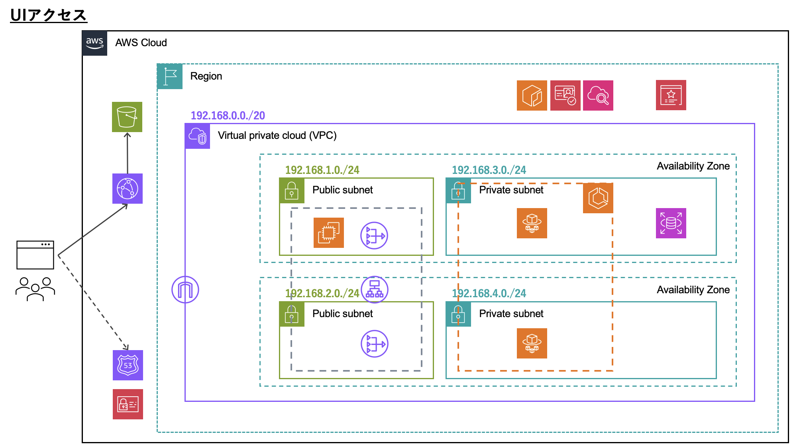
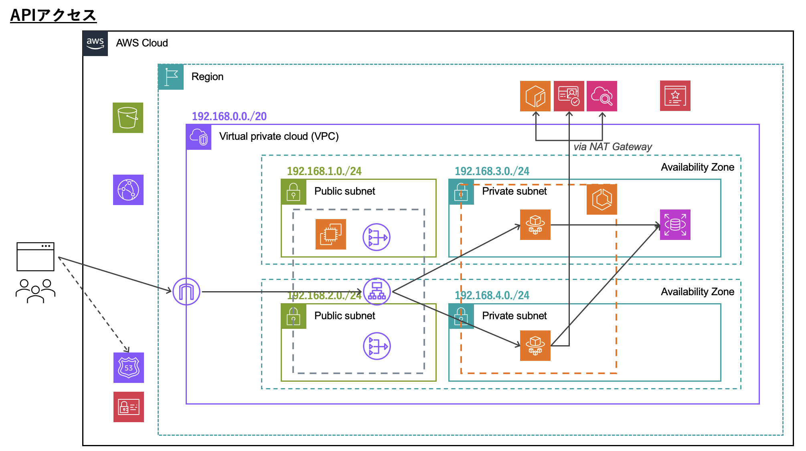
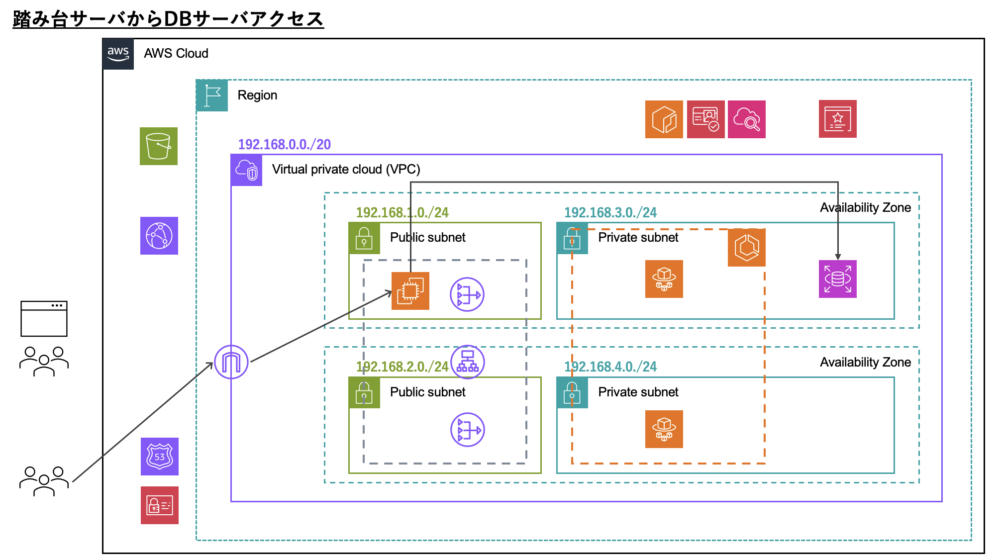

# terraform-simple-web-app-infrastructure &middot; 

シンプルなWebアプリケーションのインフラをTerraformで構築します。

<!-- ## Usage

### 初期化

```
$ terraform init
```

### 変数設定ファイル追加

リポジトリルートに `terraform.tfvars` を作成し、変数を設定します。

```
project                 = "sample"
user                    = "terraform"
db_username             = "db_username"
db_password             = "db_password"
db_port                 = 3306
db_name                 = "sample_app_db"
route_53_zone_id        = "route_53_zone_id"
us_east_1_cert_arn      = "us_east_1_cert_arn"
ap_northeast_1_cert_arn = "ap_northeast_1_cert_arn"
domain                  = "example.com"
ecr_image               = "ecr_image"
```

`project` と `user` はそれぞれ任意の値を設定してください。
これらは基本的に各AWSリソースのname属性やNameタグで使用しています。
主な目的は、このリポジトリで作成したリソースをコンソール上で見つけやすくすることです。

```
# 使用例1
name = "${var.user}-${var.project}-alb"

# 使用例2
tags = {
  Name    = "${var.user}-${var.project}-vpc"
  Project = var.project
  User    = var.user
}
```

`db_` から始まる変数はDBの設定値です。

このリポジトリでは、以下のAWSサービスはTerraform管理外としています。

- Route53ゾーン
- ACM
- ECR

そのため、`route_53_zone_id`, `us_east_1_cert_arn`, `ap_northeast_1_cert_arn`, `ecr_image` でそれらTerraform管理外のリソース情報を設定します。

`domain` はドメインです。
Route53のレコード等で使用します。

### ssh-key作成

ローカルで公開鍵・秘密鍵を生成し、`ssh-key` に配置します。
この鍵はEC2のキーペアに使用します。
鍵名は、EC2キーペアの設定内（`ec2.tf`）で指定しているファイルパスと合わせてください。

```
# ec2.tf
public_key = file("./ssh-key/ec2-keypair.pub")
```

## その他

### Terraformバージョン

現時点（2023/12/20）で、このソースコードが正常に動作することを確認しているTerraformバージョンは `1.6.6` です。

### AWS CLI プロファイルについて

`main.tf` で使用するプロファイルを指定しています。
そのため、実行時には `profile` の設定値を自身のプロファイル名に変更、
あるいは、自身のプロファイル名を `terraform` に変更してください。

```
provider "aws" {
  profile = "terraform"
  region  = "ap-northeast-1"
}
``` -->

## アーキテクチャとフロー

### 全体像


### UIアクセス



### APIアクセス



### DBアクセス


